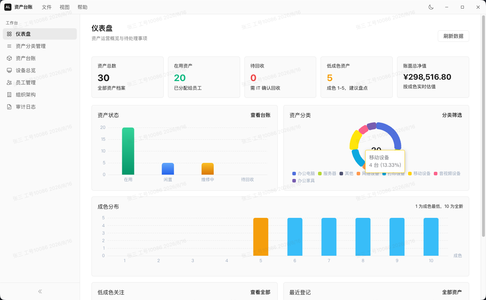
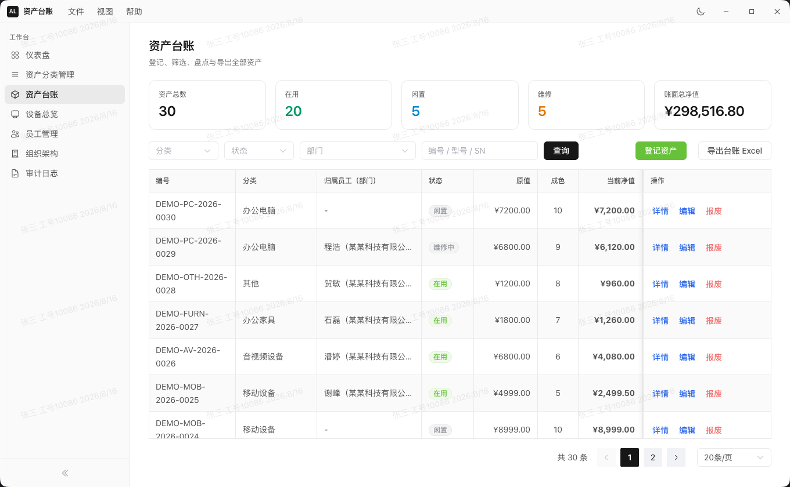
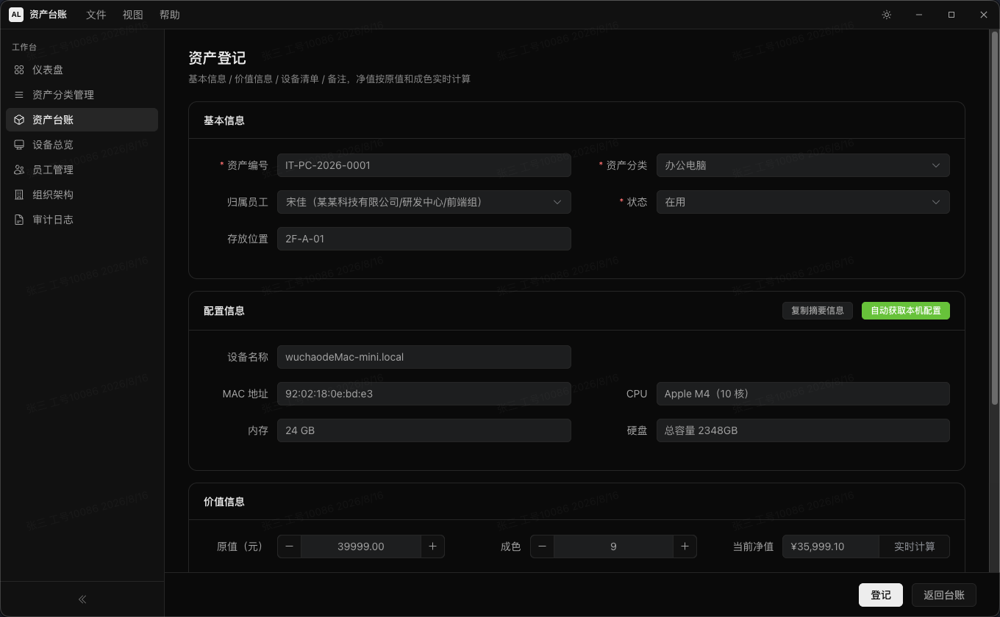
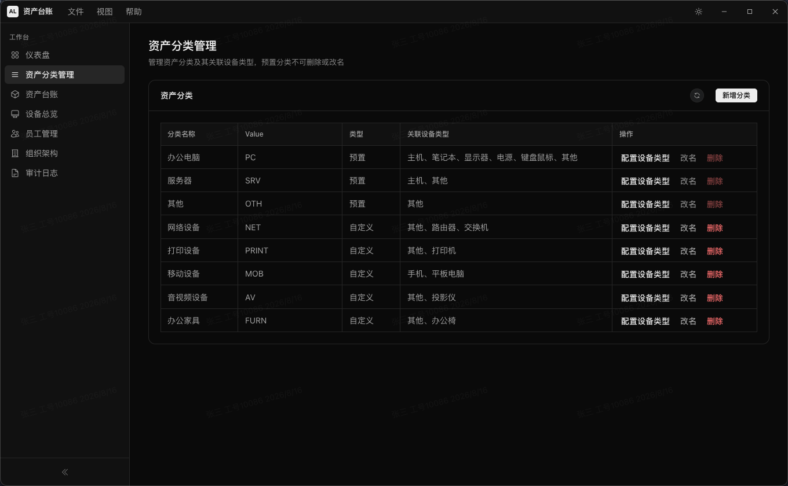
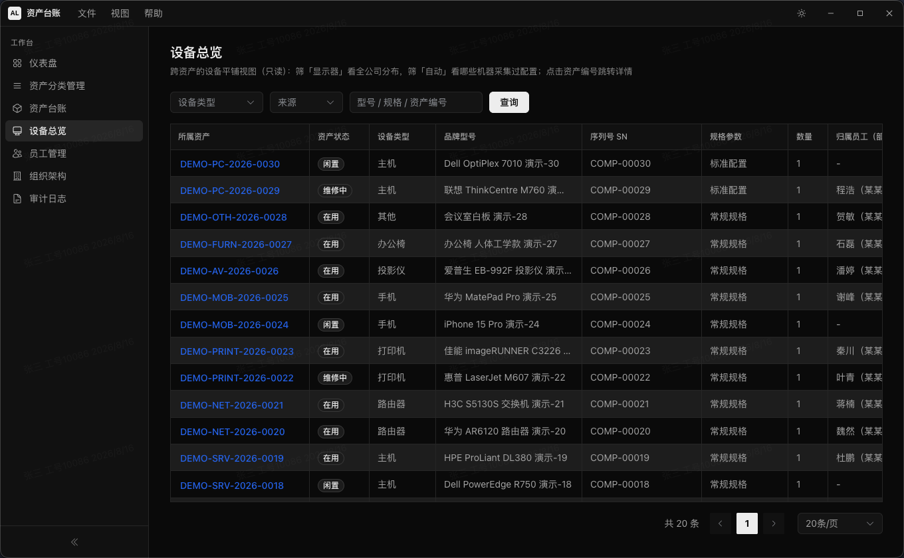
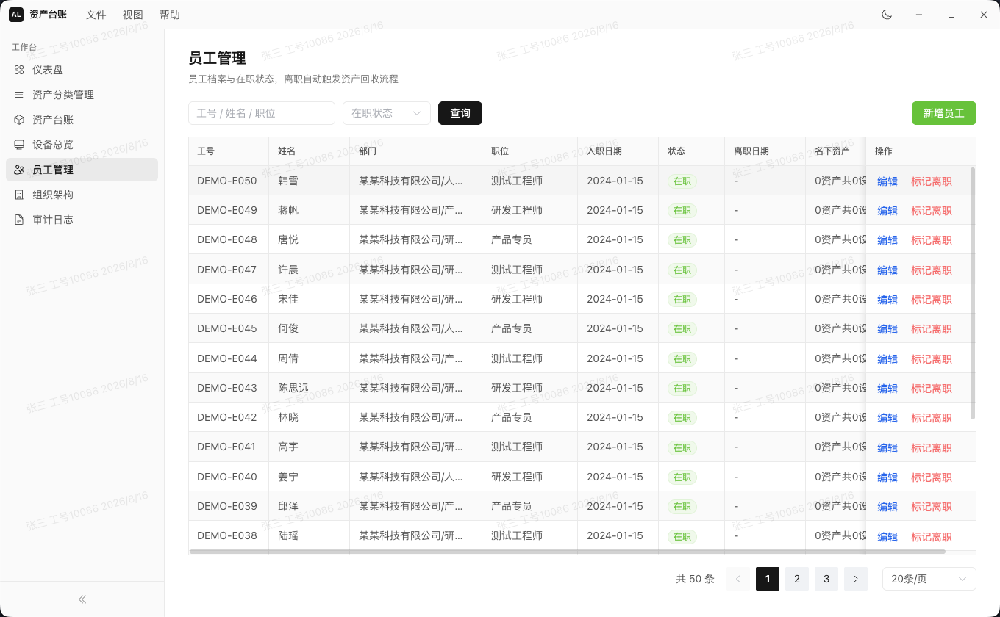
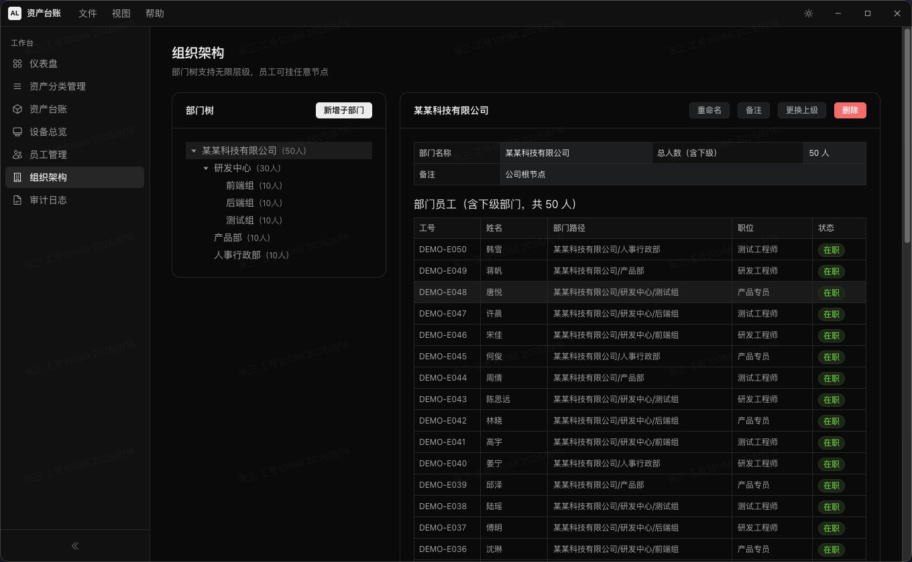
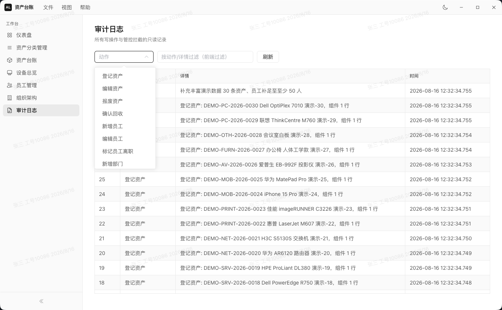

# 资产台账管理系统

桌面资产台账应用。

[PRD](docs/prd/V0.1.0/PRD.md) · [流程图](docs/prd/V0.1.0/业务流程图.md) · [开发计划](docs/develop/开发计划V0.1.0.md) · [迭代日志](docs/changelogs/V0.1.0.md)

## 环境

- Windows 10/11、macOS、Linux
- Node.js 22+
- pnpm 10.34.5
- MySQL 8+

项目仅允许使用 pnpm 安装依赖。

## 架构

框架、目录、进程通信和安全边界见 [架构说明](docs/架构说明.md)。

## 数据库操作

重点：构建安装后需要[配置数据库连接](docs/数据库操作.md)（包含：数据库初始化、清理和演示数据注入说明）。

## 功能

- 部门、员工与资产台账管理
- 资产分类及关联设备类型管理
- 资产登记、设备清单、成色估值与本机配置采集
- 设备总览、Excel 导出、审计日志与安全水印
- 仪表盘统计和资产状态、分类、成色图表

## 界面预览

### 仪表盘



### 资产台账



### 资产登记



### 资产分类管理



### 设备总览



### 员工管理



### 组织架构



### 审计日志



## 快速开始

```sh
pnpm i
```

如果 Electron 安装阶段失败，或启动时提示 Electron 二进制缺失，请在项目目录执行：

```sh
pnpm rebuild electron
```

项目已通过 `.npmrc` 配置 Electron 镜像，重建时会继续使用该镜像下载。

复制数据库配置文件：

```powershell
# Windows PowerShell
Copy-Item .\db.config.example.json .\db.config.json
```

```sh
# macOS / Linux
cp ./db.config.example.json ./db.config.json
```

```sh
pnpm run dev
```

## 常用命令

```sh
pnpm run dev        # 开发模式
pnpm run build      # 构建应用
pnpm run check      # 类型、ESLint、Stylelint 校验
pnpm run smoke      # 冒烟测试
pnpm run ipc-test   # IPC 集成测试
pnpm run dist       # 构建当前平台安装包
pnpm run dist:mac   # 在 macOS 上构建 DMG 与 ZIP 安装包
```
