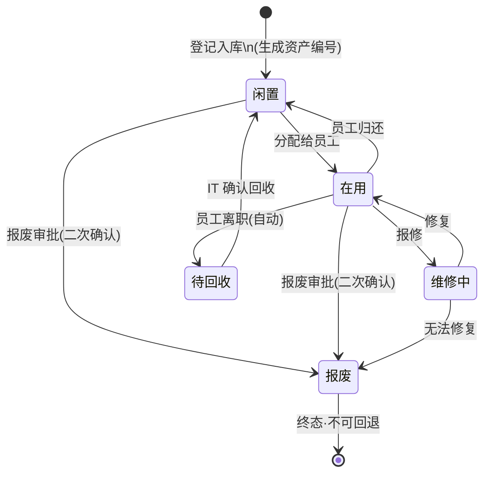
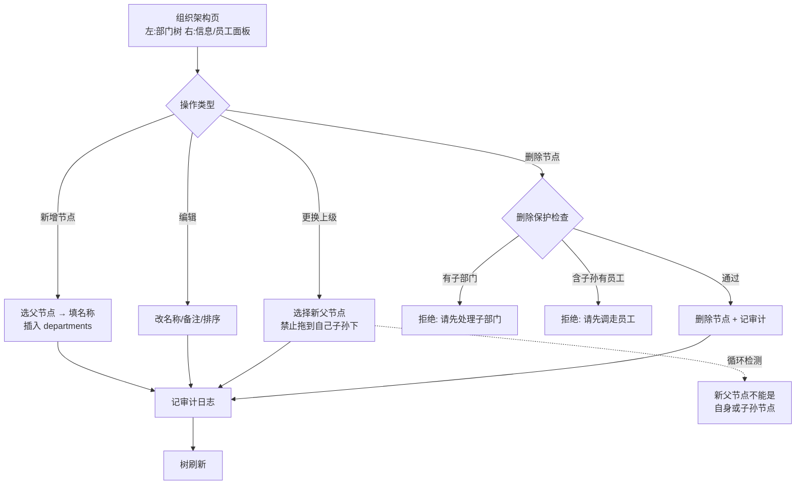
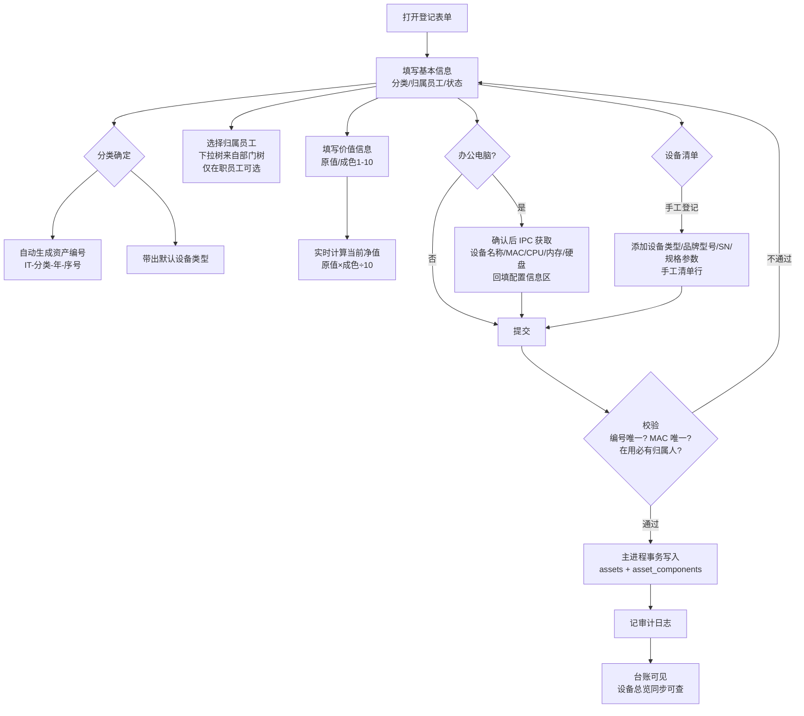
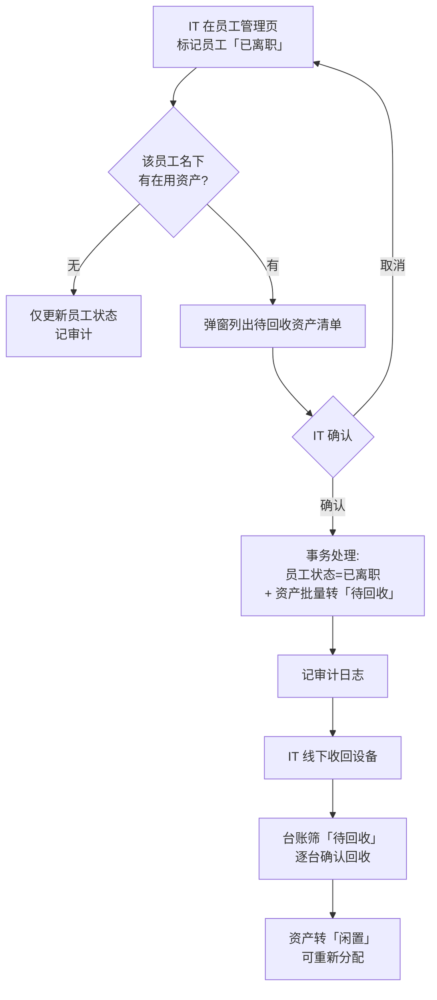
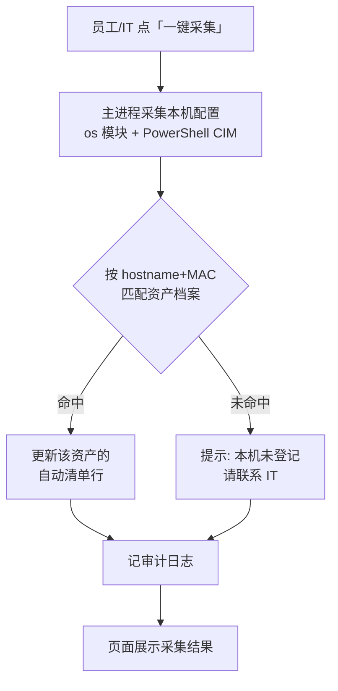
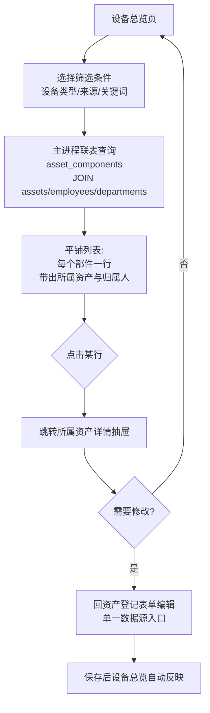
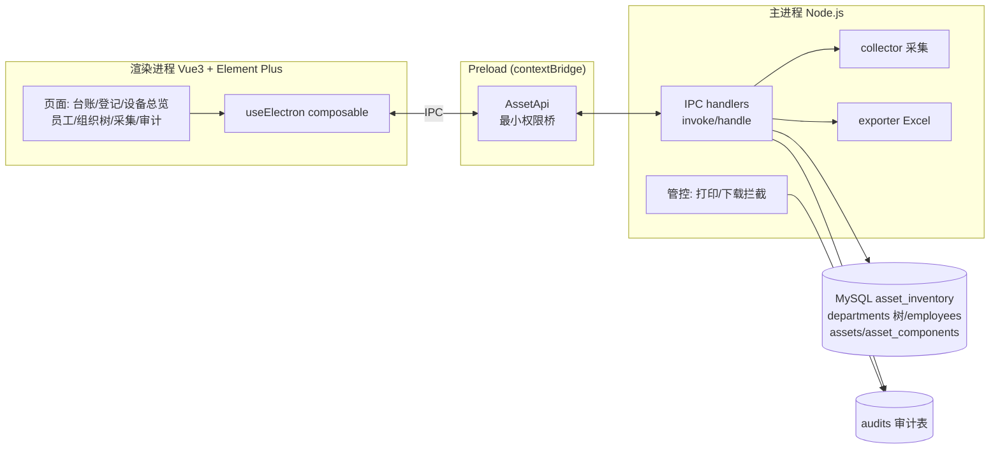

# 业务流程图

采集流程补充：先按 hostname/MAC 去重；已采集则提示并停止。数据含 MAC 和磁盘总容量，不含系统用户名；使用人在登记时填写。

> 配套：[PRD.md](./PRD.md) · [开发计划V0.1.0.md](../../develop/开发计划V0.1.0.md)
> Mermaid 源码，VS Code 装 "Markdown Preview Mermaid Support" 插件即可预览。

> 最新分类口径：PC/NB/MON 统一展示为“办公电脑”；设备清单不含“基础配置”，显示器、电源、鼠标、键盘等全部手工填写；配置采集仅回填配置信息区。

## 1. 资产全生命周期（状态机）

## 2. 组织架构维护流程（部门树）

## 3. 资产登记流程

员工列表展示：`X资产共N设备`，X 为名下未报废资产档案数，N 为设备清单数量合计；空清单资产至少计为 1 台。

## 4. 员工离职 → 资产回收流程

## 5. 本机采集上报流程

## 6. 设备总览查询流程

## 7. 系统架构与数据流

